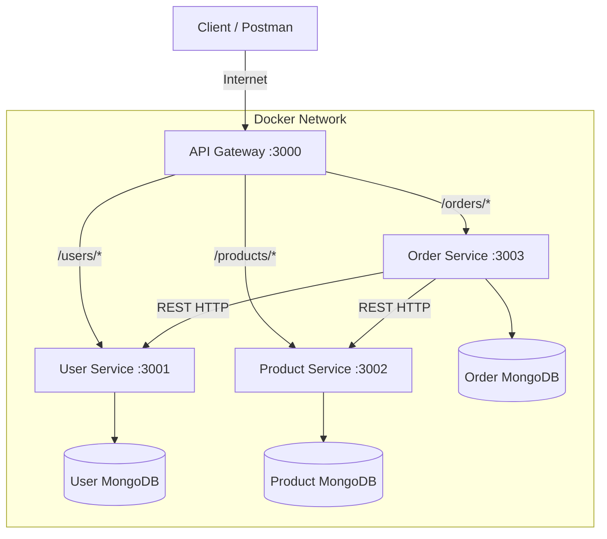

# Lab 7 Assignment: API Gateway, Service Discovery & Cloud Deployment

## Architecture Diagram

## API Gateway Discussion
**Why introduce an API Gateway instead of letting clients call each service directly?**
An API Gateway acts as a single, unified entry point for clients, effectively hiding the internal complexity of the microservices architecture. Instead of clients needing to know the exact IP/port of every individual service, they only talk to the Gateway. This centralized approach also allows us to implement cross-cutting concerns in one place—such as unified error handling (returning clean 502/503 errors), request logging, authentication, and rate limiting—rather than duplicating that logic across every microservice.

## Service Discovery Discussion
**Static (Configuration-Based) vs. Dynamic Service Discovery**
In this lab, we used a static configuration-based approach where service locations are passed via environment variables (e.g., `USER_SERVICE_URL`). This is simple and lightweight. However, a dynamic service discovery registry (like Consul, Eureka, or Kubernetes DNS) provides automated health checking and dynamic IP tracking. If a container crashes and spins up with a new internal IP address, a dynamic registry automatically updates the routing table without any manual configuration changes or gateway restarts, which a static configuration file cannot do.

## Deployment Steps
To deploy this architecture to a cloud provider (e.g., Render, Railway):
1. Create a new Web Service for the API Gateway, and background worker services for User, Product, and Order.
2. Link them to a managed MongoDB Atlas cluster.
3. Configure the environment variables on the cloud platform:
   - For `api-gateway`, set `USER_SERVICE_URL`, `PRODUCT_SERVICE_URL`, and `ORDER_SERVICE_URL` to the internal URLs provided by your cloud provider for those specific services.
4. Expose only the API Gateway to the public internet. 
5. Test the public URL using Postman.

## Troubleshooting Notes
**Issue**: Receiving `503 Service Unavailable` when calling `/orders`.
**Cause**: The Order service depends on the User and Product services. When using `depends_on` in Docker Compose, the Order service might start before the User/Product services are fully ready to accept connections.
**Resolution**: We utilized the custom error handling in our `http-proxy-middleware` inside the API Gateway to catch connection errors and gracefully return a `503` JSON response instead of crashing the Node.js proxy server. Wait a few seconds and the services will recover.
